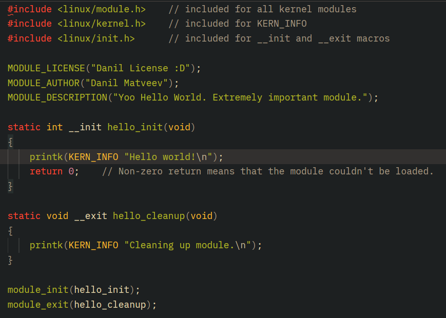
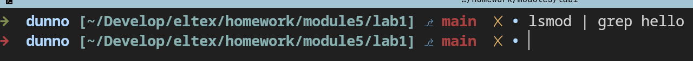
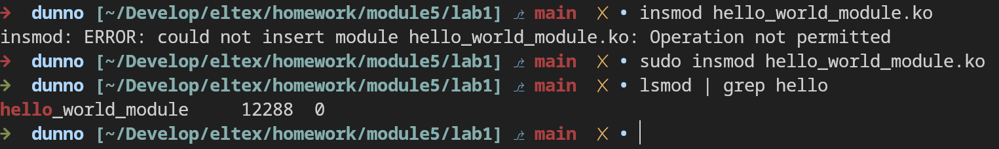
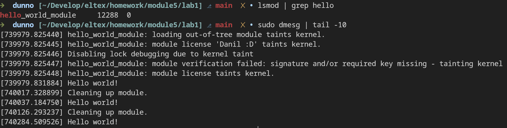
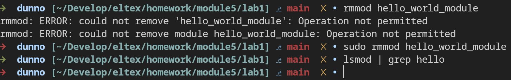

# Задание 1 по модулю 5: Написать модуль ядра Hello World для своей версии ядра

Поменял лицензию на собственную, указал автора, поменял описание.

Запускаем `lsmod` и убеждаемся что модуль пока что не загружен.

С помощью `insmod` загружаем и проверяем.

Смотрим в журнал. Модуль загружен, но пока ещё не выгружен. Можно увидеть что это третья подряд загрузка. Есть предупреждения о том что новый модуль является сторонним, имеет неизвестную лицензию и ещё о том что у модуля нед подписи.

А теперь выгружаем с помощью `rmmod`.

