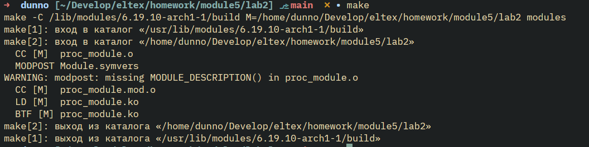
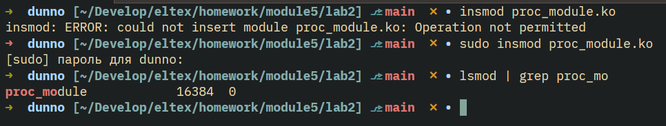
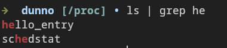
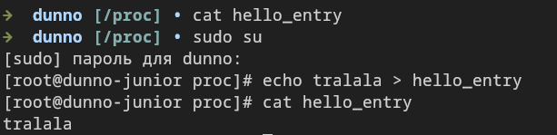
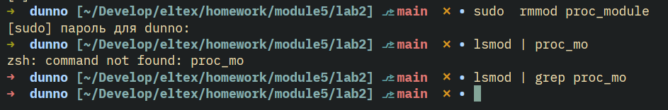

# Задание 2 Написать модуль ядра для своей версии ядра, который будет обмениваться информацией с userspace через proc

Добавлены модификаторы static, использована поддерживаемая структура обработчиков proc_ops для моей версии ядра (`6.19.10-arch1-1`). Добавлен вывод предупреждения в лог в случае если `copy_to_user/copy_from_user` возвращают ненулевое значение.

Сборка модуля теперь проходит без предупреждений:

Добавим модуль и проверим что он загружен:

В `/proc` появился файл!

Проверка содержимого и запись:

Теперь можно добросовестно его выгрузить:

