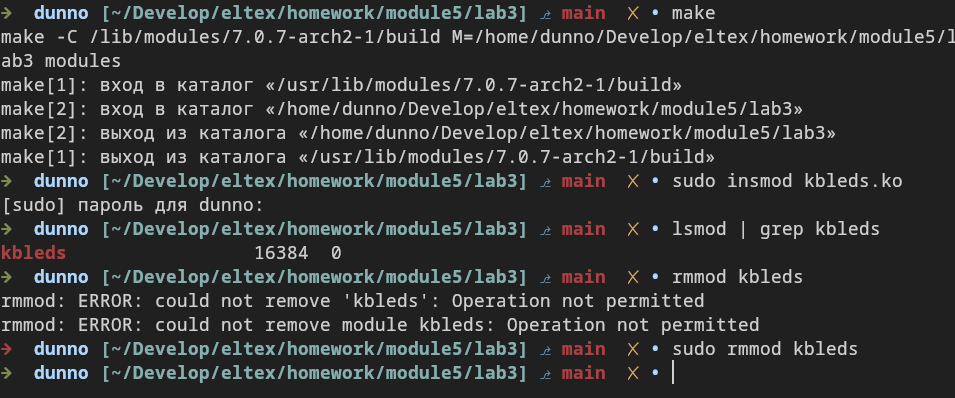
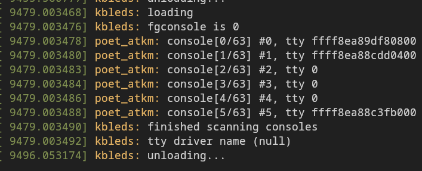
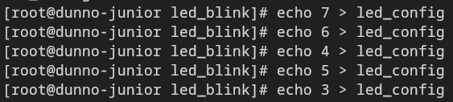

# Задание 3. Используя исходники модуля ядра сделать мигание лампочек на клавиатуре используя ioctl. Управлением миганием сделать через sysfs

Модифицировал kbleds.c, добавил управление через sysfs, файл /sys/kernel/led_blink/led_config.
Добавил прототипы функций. Собирал уже на ядре `7.0.7-arch2-1` 
На этой версии в структуре `tty_driver` нет поля `magic`, поэтому для вывода использовал поле `driver_name`.
И ещё сборке мешала функция `del_timer`, пришлось заменить на `timer_delete_sync`, по примеру из "The Linux Kernel Module Programming Guide" для версии ядра выше 6.x.

Сборка, загрузка и выгрузка:

Вывод `dmesg`:

Запись в `led_config`:

